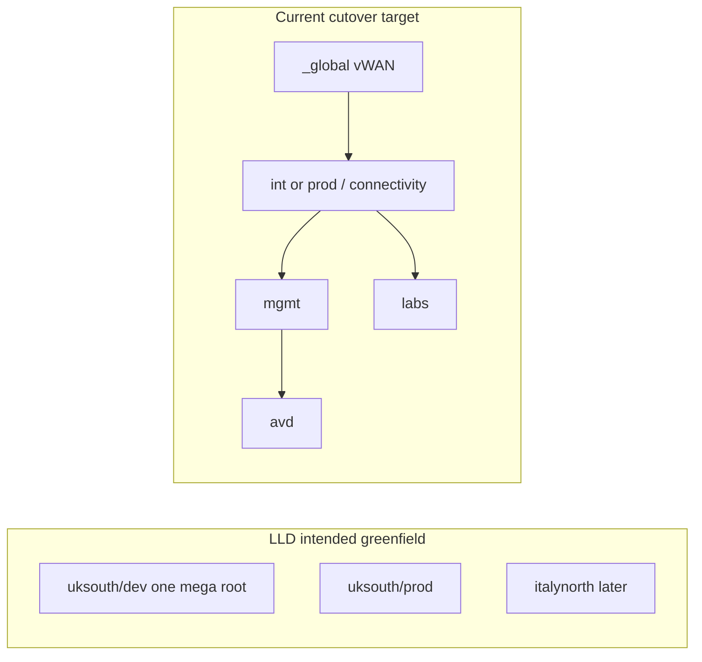
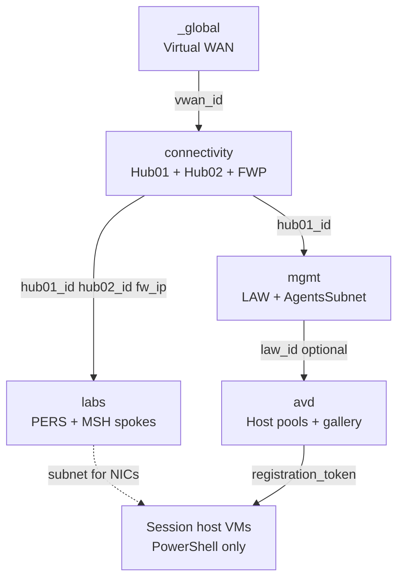
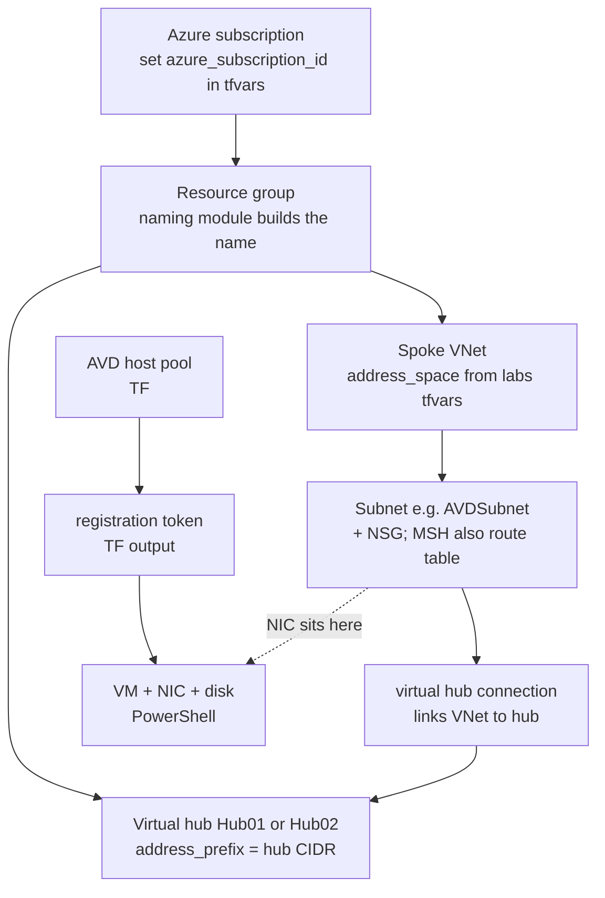
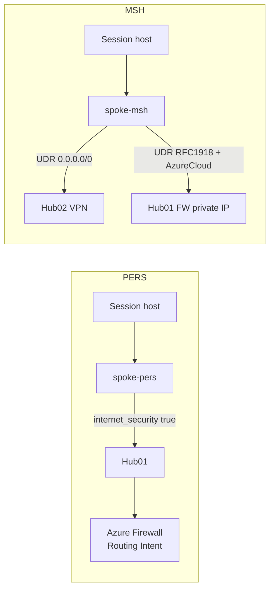
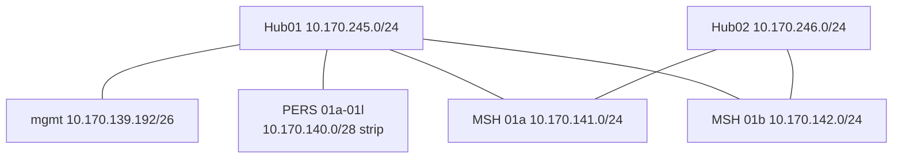

# Dummy’s guide — how this Terraform repo works

**Read this if you are new.**  
It explains the repo in plain English, shows the network with IP ranges, lists every value that is already set, and lists every placeholder you must fill before a real deploy.

**Companion docs**


| Doc                                                                                          | What it is                                                                                |
| -------------------------------------------------------------------------------------------- | ----------------------------------------------------------------------------------------- |
| [lld-terraform-summary.md](lld-terraform-summary.md)                                         | Short extract of the original **Terraform Low Level Design** (Word doc, DRAFT 2026-07-15) |
| [address-plan-hubs.md](address-plan-hubs.md)                                                 | Hub/spoke CIDR notes                                                                      |
| [variable-set.md](variable-set.md)                                                           | Tags / DNS / identity                                                                     |
| [subscription-inventory.md](subscription-inventory.md)                                       | SPNs + known gallery GUIDs                                                                |
| [plans/02-azure-1.0-to-terraform-migration.md](plans/02-azure-1.0-to-terraform-migration.md) | Migration plan that shaped `int`/`prod` stacks                                            |


**Original LLD path (authoritative Word):**  
`C:\Users\Dan\Documents\terraform low level design .docx`

---


## 0. Super simple: what is this thing?

Imagine building a city:


| City part                      | In Azure / this repo                            |
| ------------------------------ | ----------------------------------------------- |
| Motorway interchange           | **Virtual WAN** + two **hubs**                  |
| Neighbourhoods                 | **Spokes** (VNets) for labs / mgmt              |
| Streets                        | **Subnets** (where VMs will live)               |
| Estate office rules            | **AVD host pools / workspaces / scaling plans** |
| Photo library of house designs | **Compute Gallery** + image definitions         |
| Actual houses / people         | **Session host VMs** — **not** Terraform        |


**Terraform builds the roads and the office paperwork.**  
**PowerShell / AzDo pipelines build the session-host VMs and put them on those roads.**

---


## 1. Why Does this Exist - what is the purpose?

From the LLD:

1. Implement **Azure 2.0** VDI on **Azure Virtual WAN**.
2. **Hub01 (secured)** = personal desktops (**PERS**) — traffic through **Azure Firewall** + **Routing Intent** + ExpressRoute.
3. **Hub02 (unsecured)** = multi-session (**MSH**) — internet via **VPN** toward Palo Alto Proxy.
4. **Implement Secure Hub with Azure Firewall Policy rules (replacing legacy - 24/07/2026 - TO DO)**
5. Code lives in a monorepo: `modules/` **= reusable Lego bricks**, `environments/` **= “build this Lego set with these sizes”**.


### LLD layout vs what we deploy today

The LLD drew region folders like `uksouth/dev`.  
For the **Azure 1.0 → Terraform cutover** we use **per-subscription stacks** instead (because the live estate already has separate hub / mgmt / avd / lab subscriptions).




| LLD idea                          | Today                                                           |
| --------------------------------- | --------------------------------------------------------------- |
| `environments/uksouth/{dev,prod}` | Still in repo as **demo / superseded** — do not use for cutover |
| First live env                    | `int` (DT = dev test)                                           |
| Production                        | `prod` (legacy code `prd`)                                      |
| Italy / Spain                     | LLD future — not cutover yet                                    |


---


## 2. Mental model — five folders that talk to each other

Deploy **in this order**:

```text
1. environments/_global          → creates the Virtual WAN
2. environments/<env>/connectivity → Hub01 + Hub02 + thin firewall policy
3. environments/<env>/mgmt         → Log Analytics + mgmt spoke
4. environments/<env>/labs         → PERS/MSH VNets + FSLogix storage
5. environments/<env>/avd          → host pools, scaling, gallery, KV
```

`<env>` is `int` or `prod`.




**How to read that:** each stack prints **outputs**. The next stack pastes those into its **tfvars**. Nothing magic — just copy IDs between folders.

---


## 3. From subscription down to a VM (layer cake)

This is the whole stack, top to bottom.




### What Terraform creates at each layer


| Layer                              | PERS lab       | MSH lab        | How is it Created?              |
| ---------------------------------- | -------------- | -------------- | ------------------------------- |
| VNet + subnet + NSG                | yes            | yes            | TF (`spoke-pers` / `spoke-msh`) |
| Route table (UDR)                  | **no**         | **yes**        | TF (`spoke-msh`)                |
| Link to Hub01                      | yes            | yes            | TF                              |
| Link to Hub02                      | no             | yes            | TF                              |
| Host pool / workspace / scaling    | in `avd` stack | in `avd` stack | TF                              |
| Gallery image **definition**       | —              | —              | TF                              |
| Gallery image **version** (Packer) | —              | —              | Packer / PS                     |
| Session host VM                    | —              | —              | **PowerShell**                  |


### Traffic: PERS vs MSH (LLD §4.2–4.3)




**PERS:** Hub01 Routing Intent steers traffic through the firewall. No route table on the spoke.  
**MSH:** Spoke route table **overrides** that for internet (`0.0.0.0/0` → Hub02) and sends private/Azure traffic to Hub01 firewall IP.

> **Caveat (still open):** Hub02 VPN **peer/site** is not wired yet, and the exact `0.0.0.0/0` next-hop type under vWAN is marked `PENDING(LLD)` in code. Scaffold is ready; production VPN settings wait on network.

---


## 4. IP ranges — what is coded today (verified)

Shared DNS (both envs): `10.19.96.1`, `10.19.97.1 [IB ON PREM]`

### Hubs [PENDING CORRECT IP RANGES]


| Env      | Hub01 (secured)   | Hub02 (unsecured) |
| -------- | ----------------- | ----------------- |
| **int**  | `10.170.245.0/24` | `10.170.246.0/24` |
| **prod** | `10.170.247.0/24` | `10.170.244.0/24` |


Do **not** use prod Hub02 `10.170.248.0/24` — that collides with PERS lab **01l** `10.170.248.0/21`.

### Mgmt spoke (AgentsSubnet = whole VNet)


| Env  | CIDR                |
| ---- | ------------------- |
| int  | `10.170.139.192/26` |
| prod | `10.170.241.64/26`  |


### INT — PERS labs (each VNet = AVDSubnet)


| Lab | CIDR                |
| --- | ------------------- |
| 01a | `10.170.140.0/28`   |
| 01b | `10.170.140.16/28`  |
| 01c | `10.170.140.32/28`  |
| 01d | `10.170.140.48/28`  |
| 01e | `10.170.140.64/28`  |
| 01f | `10.170.140.80/28`  |
| 01g | `10.170.140.96/28`  |
| 01h | `10.170.140.112/28` |
| 01i | `10.170.140.128/28` |
| 01j | `10.170.140.144/28` |
| 01k | `10.170.140.160/28` |
| 01l | `10.170.140.176/28` |


### INT — MSH labs

**01a** VNet `10.170.141.0/24`


| Subnet        | CIDR                |
| ------------- | ------------------- |
| AVDSubnet-001 | `10.170.141.0/27`   |
| AVDSubnet-002 | `10.170.141.32/27`  |
| AVDSubnet-003 | `10.170.141.64/27`  |
| AVDSubnet-004 | `10.170.141.96/27`  |
| AVDSubnet-008 | `10.170.141.128/27` |
| AVDSubnet-009 | `10.170.141.160/27` |


**01b** VNet `10.170.142.0/24`


| Subnet        | CIDR                |
| ------------- | ------------------- |
| AVDSubnet-005 | `10.170.142.0/25`   |
| AVDSubnet-006 | `10.170.142.128/27` |
| AVDSubnet-007 | `10.170.142.160/27` |
| AVDSubnet-999 | `10.170.142.192/27` |


### PROD — PERS labs


| Lab | CIDR              |
| --- | ----------------- |
| 01a | `10.170.160.0/21` |
| 01b | `10.170.168.0/21` |
| 01c | `10.170.176.0/21` |
| 01d | `10.170.184.0/21` |
| 01e | `10.170.192.0/21` |
| 01f | `10.170.200.0/21` |
| 01g | `10.170.208.0/21` |
| 01h | `10.170.216.0/21` |
| 01i | `10.170.224.0/22` |
| 01j | `10.170.241.0/27` |
| 01k | `10.170.232.0/21` |
| 01l | `10.170.248.0/21` |


### PROD — MSH labs

**01a** VNet `10.218.16.0/21`


| Subnet        | CIDR             |
| ------------- | ---------------- |
| AVDSubnet-001 | `10.218.16.0/24` |
| AVDSubnet-002 | `10.218.17.0/24` |
| AVDSubnet-003 | `10.218.18.0/24` |
| AVDSubnet-004 | `10.218.19.0/24` |
| AVDSubnet-008 | `10.218.20.0/26` |
| AVDSubnet-009 | `10.218.21.0/24` |


**01b** VNet `10.218.24.0/21`


| Subnet        | CIDR             |
| ------------- | ---------------- |
| AVDSubnet-005 | `10.218.24.0/22` |
| AVDSubnet-006 | `10.218.28.0/24` |
| AVDSubnet-007 | `10.218.29.0/24` |
| AVDSubnet-999 | `10.218.31.0/24` |


### INT address cartoon




---


## 5. What each stack is currently set to

Values below are **defaults in code** or **tfvars.example**. Anything marked ⚠️ is a placeholder (see §7).

### `_global`


| Item                           | Current                                                              |
| ------------------------------ | -------------------------------------------------------------------- |
| `location`                     | `uksouth`                                                            |
| `environment` (naming segment) | `prd`                                                                |
| `subscription_code`            | `conn`                                                               |
| Creates                        | 1× Virtual WAN (Standard)                                            |
| `azure_subscription_id`        | ⚠️ placeholder zeros                                                 |
| `mandatory_tags`               | ⚠️ must supply (example: CLL411S1XJ / Limited / Fletcher… / AL17611) |


### `connectivity` (int / prod)


| Item                    | int                                            | prod              |
| ----------------------- | ---------------------------------------------- | ----------------- |
| `environment`           | `int`                                          | `prod`            |
| `subscription_code`     | `conn`                                         | `conn`            |
| Hub01 prefix            | `10.170.245.0/24`                              | `10.170.247.0/24` |
| Hub02 prefix            | `10.170.246.0/24`                              | `10.170.244.0/24` |
| DNS                     | `10.19.96.1`, `10.19.97.1`                     | same              |
| Firewall policy rules   | **empty** (stub so AZFW can attach)            | same              |
| ER circuit peering      | `null` (gateway only)                          | same              |
| Hub02 VPN               | gateway scaffold only — **no site/connection** | same              |
| `virtual_wan_id`        | ⚠️ from `_global` output                       | ⚠️                |
| `azure_subscription_id` | ⚠️                                             | ⚠️                |


### `mgmt`


| Item                    | int                     | prod               |
| ----------------------- | ----------------------- | ------------------ |
| `subscription_code`     | `mgmt`                  | `mgmt`             |
| Mgmt CIDR               | `10.170.139.192/26`     | `10.170.241.64/26` |
| LAW retention           | **30** days             | **30** days        |
| DCE + AVD insights DCR  | on                      | on                 |
| Agent VMSS              | **not TF** (PowerShell) | same               |
| `mgmt_role_assignments` | `{}` empty              | `{}`               |
| `hub01_id`              | ⚠️ from connectivity    | ⚠️                 |


### `labs`


| Item                | int                                            | prod   |
| ------------------- | ---------------------------------------------- | ------ |
| `subscription_code` | `vdi`                                          | `vdi`  |
| PERS / MSH maps     | see §4                                         | see §4 |
| FSLogix             | enabled; share `profiles` **5120** GB; AADKERB | same   |
| Hub IDs + FW IP     | ⚠️                                             | ⚠️     |


### `avd`


| Item                     | int                                              | prod                                             |
| ------------------------ | ------------------------------------------------ | ------------------------------------------------ |
| `subscription_code`      | `vdi`                                            | `vdi`                                            |
| MSH host pools           | **30** (`001-00` … `999-02`)                     | same map                                         |
| Max sessions             | **16**                                           | **16**                                           |
| Load balance             | BreadthFirst                                     | BreadthFirst                                     |
| Scaling                  | 1 standard SP + 1 decom SP **per** pool          | same                                             |
| BU **005**               | special `*_005` schedules                        | same                                             |
| Pool `*-00`              | canary schedules                                 | same                                             |
| `pers_host_pools`        | `{}` → **no** PERS AVD objects until filled      | `{}`                                             |
| Gallery                  | ~50 image definitions                            | same                                             |
| KV unique id             | `avdint1`                                        | `avdprd1`                                        |
| Example AVD/gallery GUID | `717872a8-000f-4990-a35b-0f957a9c7856` (confirm) | `a6fe8767-8373-4b41-ad17-b4301ca6fcd0` (confirm) |
| Packer MSI RBAC          | `{}` empty                                       | `{}`                                             |


MSH pool keys: `001-00`, `001-01`, `001-02`, … through `009-*`, then `999-00`…`999-02`.

---


## 6. Modules in plain English (LLD catalogue)


| Folder                             | Job                                                                             |
| ---------------------------------- | ------------------------------------------------------------------------------- |
| `modules/naming`                   | Builds bank-compliant names. You never invent `uks-…` strings by hand.          |
| `modules/tags`                     | Merges mandatory bank tags + auto tags. Plan fails if a mandatory tag is blank. |
| `modules/platform/vwan`            | The shared Virtual WAN.                                                         |
| `modules/platform/hub-secured`     | Hub01 + firewall + ER + routing intent.                                         |
| `modules/platform/hub-unsecured`   | Hub02 + VPN gateway shell.                                                      |
| `modules/platform/firewall-policy` | Where firewall **rules** live (currently empty stub).                           |
| `modules/platform/management`      | Log Analytics (+ optional DCR/DCE/alerts).                                      |
| `modules/core/spoke-pers`          | Lab VNet for PERS → Hub01 only.                                                 |
| `modules/core/spoke-msh`           | Lab VNet for MSH → both hubs + UDR.                                             |
| `modules/core/keyvault`            | Key Vault shell (secrets filled by PS).                                         |
| `modules/core/storage-fslogix`     | FSLogix storage + shares (profile delete stays PS).                             |
| `modules/avd/hostpool`             | Host pool + rotating registration token.                                        |
| `modules/avd/workspace`            | Workspace + app groups.                                                         |
| `modules/avd/scalingplan`          | Power schedules (pooled **and** personal).                                      |
| `modules/gallery/*`                | Gallery + definitions; Packer publishes **versions**.                           |


Naming abbreviations you will see: `vwn` vWAN, `vhb` hub, `afw` firewall, `fwp` policy, `net` VNet, `vdh` host pool, `vdw` workspace, `vda` app group, `vds` scaling plan, `gal` gallery, `img` image def, `kvt` key vault, `law` Log Analytics.

---


## 7. Full placeholder list — fill these to deploy

Copy `terraform.tfvars.example` → `terraform.tfvars` (do not commit secrets).  
Anything with **zeros**, **REPLACE**, or empty maps below **blocks a real apply** or leaves a capability unfinished.

### 7.1 Required before first `apply` (tenant / subscription)


| #   | Where                                     | Placeholder                                             | What to put                                                                                  |
| --- | ----------------------------------------- | ------------------------------------------------------- | -------------------------------------------------------------------------------------------- |
| 1   | every stack `azure_subscription_id`       | `00000000-…` (or confirm gallery GUID on avd)           | Real subscription GUID for that scope                                                        |
| 2   | `_global` / all stacks `mandatory_tags.*` | example bank tags                                       | Real `costCentre`, `securityClassification`, `resourceOwner`, `CMDB_AppID` for that workload |
| 3   | AzDo / shell                              | tenant ID                                               | `ARM_TENANT_ID` / AzDo macros `common_*_tenantId`                                            |
| 4   | AzDo                                      | service connection                                      | e.g. `SC-R-VDI-INT-C-01` / `SC-P-VDI-PRD-C-01`                                               |
| 5   | AzDo pipeline vars                        | `tf.backend.resourceGroup`, `tf.backend.storageAccount` | State storage for `backend "azurerm"`                                                        |
| 6   | connectivity                              | `virtual_wan_id` = `.../REPLACE`                        | Output `vwan_id` from `_global`                                                              |
| 7   | mgmt                                      | `hub01_id` = `.../REPLACE`                              | Output `hub01_id` from connectivity                                                          |
| 8   | labs                                      | `hub01_id`, `hub02_id`                                  | Outputs from connectivity                                                                    |
| 9   | labs                                      | `hub01_firewall_private_ip` = `10.0.0.0`                | Output `hub01_firewall_private_ip` (**not** classic `.4`)                                    |
| 10  | avd (optional but useful)                 | `law_id`                                                | Output `law_id` from mgmt                                                                    |


**Subscription GUID cells still empty in inventory** (pull from AzDo/GLB):


| Scope                    | int                                                           | prod |
| ------------------------ | ------------------------------------------------------------- | ---- |
| `_global` / connectivity | TODO                                                          | TODO |
| mgmt                     | TODO                                                          | TODO |
| lab(s)                   | TODO                                                          | TODO |
| image-build              | TODO                                                          | TODO |
| avd                      | start from known gallery GUID — **confirm** it is the AVD sub | same |


Known gallery-related GUIDs (examples only until confirmed):

- int: `717872a8-000f-4990-a35b-0f957a9c7856`
- prod: `a6fe8767-8373-4b41-ad17-b4301ca6fcd0`


### 7.2 Required for full / useful platform (not bare hubs)


| #   | Where                        | Placeholder                                             | What to put                                                    |
| --- | ---------------------------- | ------------------------------------------------------- | -------------------------------------------------------------- |
| 11  | connectivity                 | `expressroute_circuit_peering_id = null`                | Real ER private peering resource ID to attach circuit          |
| 12  | connectivity firewall policy | empty rule collections                                  | Thin allow rules **or** later Azure Policy workstream          |
| 13  | connectivity Hub02           | no VPN site/connection                                  | Palo Alto peer config from network (LLD Open Item 5)           |
| 14  | labs / `spoke-msh`           | `default_route_next_hop_type` = `VirtualNetworkGateway` | Confirm vs VPN private IP / `VirtualAppliance` when peer lands |
| 15  | avd                          | `gallery_role_assignments = {}`                         | Packer MSI `principal_id` + `Contributor`                      |
| 16  | avd                          | `keyvault_unique_id` (`avdint1` / `avdprd1`)            | Confirm **globally** unique 7-char suffix                      |
| 17  | avd                          | `pers_host_pools = {}`                                  | Map of PERS pools when you want PERS AVD objects               |
| 18  | mgmt                         | `mgmt_role_assignments = {}`                            | Group/SP object IDs + roles (legacy `access.bicep`)            |
| 19  | Entra (outside TF)           | AADKERB for FSLogix                                     | Tenant-level Kerberos setup for Azure Files                    |


### 7.3 Pipeline / identity placeholders


| #   | Item                   | Example / note                                                                     |
| --- | ---------------------- | ---------------------------------------------------------------------------------- |
| 20  | Private agent pool     | `uks-int-vdi-mgmt-vss-01` / `uks-prd-vdi-mgmt-vss-01` (PS-managed VMSS)            |
| 21  | UAA service connection | `SC-*-VDI-*-UAA-01`                                                                |
| 22  | App registration IDs   | See [subscription-inventory.md](subscription-inventory.md) (already known per env) |
| 23  | Backend state key      | pattern `{env}/{stack}.tfstate`                                                    |


### 7.4 Intentionally not filled by this repo (do not expect TFvars)


| Item                                         | Owner                              |
| -------------------------------------------- | ---------------------------------- |
| Session host VM size / image version / count | PowerShell / Packer                |
| Host pool user RBAC / AAD group membership   | PowerShell                         |
| FSLogix profile delete / housekeep           | PowerShell                         |
| Full Secure-Hub firewall rule port           | Azure Policy workstream (deferred) |
| Italy North / Spain Central env roots        | LLD Phase 8 + TDA region codes     |
| HCP Terraform workspaces                     | LLD Open Items 4, 7–12             |


### Quick “can I apply yet?” checklist

```text
[ ] Tenant ID available to the runner
[ ] Subscription GUIDs for _global, connectivity, mgmt, labs, avd
[ ] mandatory_tags real values
[ ] Backend storage for state
[ ] _global applied → paste vwan_id
[ ] connectivity applied → paste hub01_id, hub02_id, hub01_firewall_private_ip
[ ] mgmt applied → paste law_id into avd (optional)
[ ] Expect: empty FWP may block useful traffic until rules/Policy exist
[ ] Expect: MSH internet path incomplete until Hub02 VPN peer exists
```

---


## 8. How a session host actually appears (learning path)

1. TF creates **subnet** in `labs`.
2. TF creates **host pool** in `avd` and outputs a **registration token**.
3. PowerShell build pipeline picks a subnet + token + gallery image **version**.
4. Azure creates the **VM** (NIC in that subnet), agent installs, host **registers** into the pool.
5. Scaling plan (TF) powers hosts up/down; decom plan sibling exists per MSH pool but starts **disabled**.

You never `terraform apply` a session host in this design — by LLD and by migration plan.

---


## 9. How to explore the code yourself

```bash
# Offline check (no Azure creds)
cd environments/int/connectivity
terraform init -backend=false
terraform validate
```

Useful greps:

```bash
# Every deploy placeholder comment
rg "TODO\\(deploy\\)|REPLACE|00000000-" environments

# Hub CIDRs
rg "hub0[12]_address_prefix" environments/int environments/prod

# MSH pool map
rg "msh_host_pools" environments/int/avd/msh_scaling.tf
```

---


## 10. Honest “not done yet” list

So you do not think a green `validate` means production-ready traffic:

1. Firewall policy has **no allow rules** yet.
2. Hub02 has a VPN **gateway**, not a finished Palo Alto **connection**.
3. MSH default route next-hop under vWAN still needs senior/network confirmation.
4. APR / multi-DCR / deep alerts not fully ported.
5. `uksouth/*` is old greenfield shape — ignore for cutover.
6. TFC + quality-gate model from LLD §9 is mostly still open; AzDo TF templates are the current scaffold.

---


## 11. One-page cheat sheet


| Question          | Answer                                                                       |
| ----------------- | ---------------------------------------------------------------------------- |
| What does TF own? | WAN, hubs, spokes, LAW, KV shell, FSLogix storage, AVD objects, gallery defs |
| What does PS own? | Session hosts, tokens consume, decom, Packer versions, profile ops           |
| First env?        | `int`                                                                        |
| Apply order?      | `_global` → connectivity → mgmt → labs → avd                                 |
| PERS path?        | Spoke → Hub01 → Firewall                                                     |
| MSH path?         | Spoke UDR → Hub02 (internet) + Hub01 FW IP (private/Azure)                   |
| Where are IPs?    | `environments/*/labs/variables.tf` + connectivity hub vars                   |
| Where are blanks? | §7 of this doc + `*.tfvars.example`                                          |


When you fill §7 and apply in order, you get the **platform**. When pipelines build VMs into those subnets with those tokens, you get **users on desktops**.