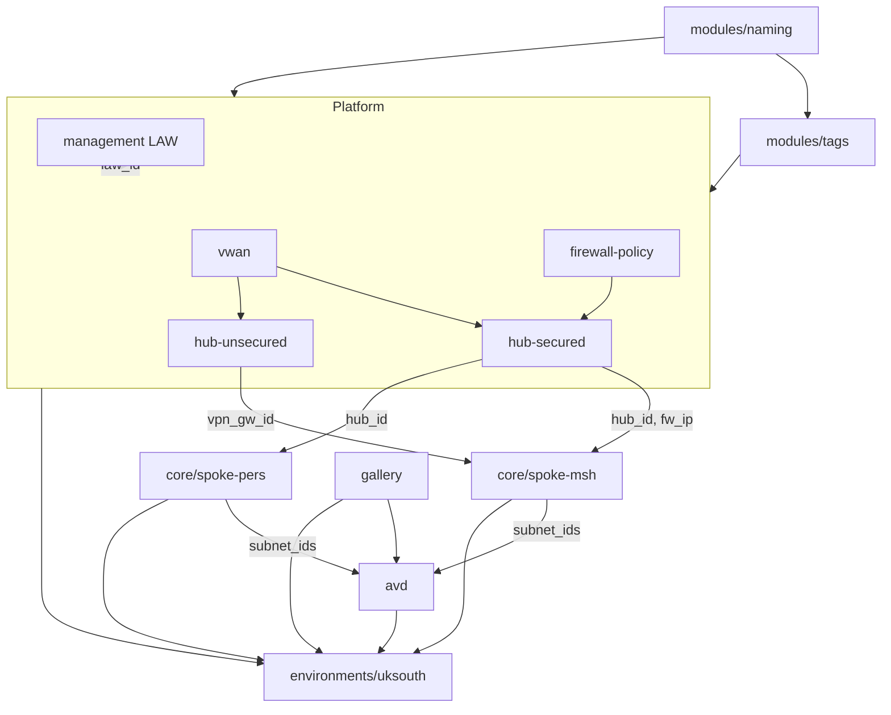

# VDI Terraform Platform Buildout (uksouth)

**Status:** Complete
**Scope:** All modules built out + `uksouth/{dev,prod}` environments. CI/CD, italynorth/spaincentral, and repo tooling deferred.

Implements the module catalogue from the Terraform low-level design against the
TDA naming/tagging standards, cross-referenced with what already existed in the repo.

## Progress checklist

- [x] Realign `modules/naming` to TDA order; fix KV/Storage/MSI patterns; correct maa/mma/mdc abbreviations
- [x] Improve `modules/tags` (merged map, validation, placeholder mandatory keys)
- [x] Refactor `avd/hostpool` and `platform/hub-secured` onto naming + tags + LAW diagnostics; verify vwan
- [x] Build `platform/firewall-policy`
- [x] Build `platform/hub-unsecured`
- [x] Build `platform/management` (LAW + DCR/DCE + action groups + alerts + workbooks)
- [x] Build `core/spoke-pers`
- [x] Build `core/spoke-msh` (dual-hub + 3-rule UDR)
- [x] Build `core/keyvault`
- [x] Build `core/storage-fslogix`
- [x] Build `avd/workspace`
- [x] Build `avd/scalingplan`
- [x] Build `gallery/gallery`
- [x] Build `gallery/image-definition`
- [x] Wire `environments/uksouth/{dev,prod}`; verify `_global`
- [x] examples/basic + versions.tf per module

## Guiding conventions (apply to every module)

- Each module gets `main.tf`, `variables.tf`, `outputs.tf`, `versions.tf`, and `examples/basic/`.
- Every resource name comes from `modules/naming` — no hardcoded names.
- Every resource's `tags` comes from `modules/tags`.
- Region-agnostic: `location` is always a variable; naming maps it to the short code. Region is selected by which `environments/<region>/<env>` root you run.
- Pending-TDA values (`itn`, `spc`, AVD/monitoring abbreviations) are included but comment-flagged.

## Phase 0 - Foundation realignment

### `modules/naming` - realigned to TDA standard
- Default pattern -> `{region}-{subscription}-{abbr}-{description}-{unique_id}`, e.g. `uks-conn-afw-hub01-01`.
- Resource Group -> default pattern with abbr `rsg`.
- Key Vault -> `{region}-{env}-kvt-{7charId}`, lowercased, <=24 chars.
- Storage Account -> `{region}{env}{abbr}{description}{id}`, no separators, alnum, <=24.
- Managed Identity -> `{subscription}-{env}-msi-{description}-{id}`.
- Compute Gallery -> underscore-joined (Azure disallows hyphens).
- Fixed abbreviations: `mma` metric alert, `maa` activity alert, `mdc` data collection rule.

### `modules/tags` - improved
- Merged-map design; precedence platform > mandatory > additional.
- Mandatory keys as documented placeholders; non-empty validation.

### Refactor existing modules
- `avd/hostpool` -> naming (`vdh`) + tags + optional LAW diagnostics.
- `platform/hub-secured` -> naming + LAW diagnostics.
- `platform/vwan` -> verified against new order.

## Phase 1 - Platform modules
- `platform/firewall-policy`: policy + rule collection groups + IP groups. Outputs `policy_id`.
- `platform/hub-unsecured`: Hub02 vHub + VPN gateway + public IPs. Outputs `hub_id`, `vpn_gateway_id`.
- `platform/management`: LAW + DCR/DCE + action groups + metric/activity/scheduled-query alerts + workbooks. Outputs `law_id`.

## Phase 2 - Core modules
- `core/spoke-pers`: VNet + subnets + NSG + watcher + Hub01 connection (no UDR).
- `core/spoke-msh`: dual-hub connections + 3-rule UDR (0.0.0.0/0 -> Hub02 VPN, service tags + RFC1918 -> Hub01 firewall).
- `core/keyvault`: KV (RBAC) + CMK keys + secrets + role assignments.
- `core/storage-fslogix`: storage account + file shares (AADKERB) + optional CMK.

## Phase 3 - AVD modules
- `avd/hostpool` (refactored in Phase 0).
- `avd/workspace`: workspace + application groups + associations.
- `avd/scalingplan`: pooled schedules (azurerm) + personal schedules (azapi).

## Phase 4 - Gallery modules
Boundary: Terraform manages gallery + image definitions only; Packer builds versions.
- `gallery/gallery`: one gallery per region + RBAC.
- `gallery/image-definition`: reusable single-definition module (instantiated per OS/SKU).

## Phase 5 - Environments (uksouth)
- `_global` (vwan) verified.
- `environments/uksouth/dev` and `environments/uksouth/prod` wire all modules.
- Each root: `main.tf`, `variables.tf`, `outputs.tf`, `providers.tf`, `terraform.tfvars.example`, `README.md`.

## Dependency flow

## Notable decisions / open items
- `azapi` provider (>= 2.0) introduced in `avd/scalingplan` for personal schedules.
- Pending TDA sign-off: `itn`/`spc` region codes, AVD/monitoring abbreviations, mandatory tag keys.
- `terraform validate` passes on all modules and env roots; `terraform plan` against real subscriptions is the outstanding validation gate.
