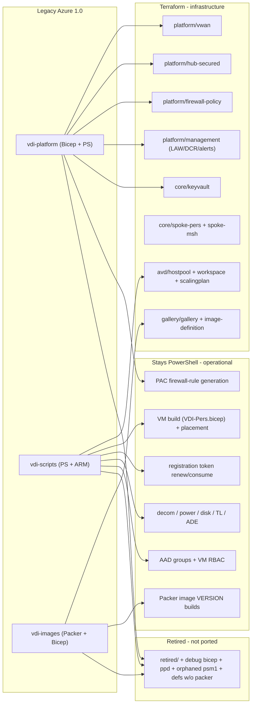
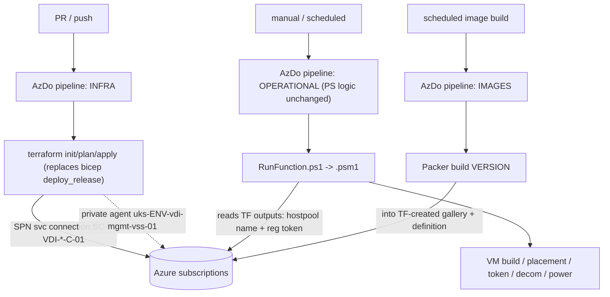
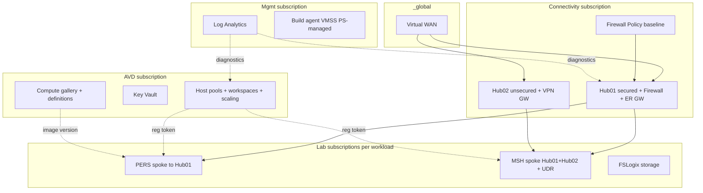
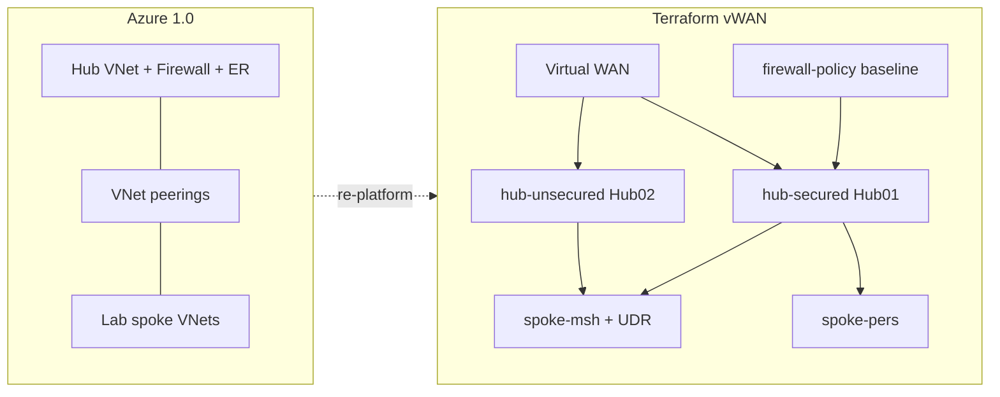

# Azure 1.0 to Terraform Migration Plan

**Status:** Scaffold complete (offline validate) — live apply blocked on creds/subs + deferred Hub02 VPN / AZFW Policy
**Scope:** Port the legacy Azure 1.0 VDI estate (Bicep + PowerShell + AzDo pipelines across vdi-platform, vdi-scripts, vdi-images) onto the new Terraform module set for a two-hub Azure Virtual WAN deploy via GitHub + AzDo.

## Progress checklist

- [x] Phase 0: live inventory across all 7 legacy repos; dead-code + pipeline-fate docs
- [x] Phase A: extend naming abbreviations, update tags mandatory keys, legacy->TDA rename map
- [x] Phase B: per-scope env roots; keep dev-tier split; drop ppd; subscription inventory; start int+prod
- [x] Phase C: re-platform peering -> vWAN; IPs/VNets/subnets verbatim; baseline firewall-policy only; Hub02 VPN/UDR placeholders
- [x] Phase D (scaffold): LAW + mgmt spoke (int+prod); FSLogix storage module in labs; optional mgmt RBAC map; agent VMSS stays PS; APR/UAMI/multi-DCR + flow logs still open
- [x] Phase E (scaffold): AVD MSH per-BU scaling + decom; PERS personal HP/SP scaffold (`pers_host_pools`); registration tokens; retire bicep HP path at cutover
- [x] Phase F (scaffold): gallery + `for_each` image definitions; Packer rename checklist (`docs/packer-tda-rename-checklist.md`)
- [x] Phase G: variable-set doc; bank tags / DNS / GUIDs / KV unique_id / RBAC via tfvars only (`docs/variable-set.md`)
- [x] Phase H: AzDo TF templates + release pipelines (`pipelines/`); keep ops PS/Packer; DEFER initiatives+GLB
- [x] IP double-check: Hub01 verified; Hub02 defaults accepted int=`10.170.246.0/24`, prod=`10.170.244.0/24` — see `docs/address-plan-hubs.md`

Ports the legacy estate in `legacy/` onto the new Terraform modules. Based on deep inventory across **seven** legacy checkouts: platform, scripts, images, mult (MSH), pers (lab spokes — verify in Phase 0), initiatives (Azure Policy — deferred), libraries (ops helpers — stays PS). Ignore `platformtest` / `scriptstest` mirrors.

## Desired outcome (north star)
Once this migration is done, the deliverable is **Terraform code that lives in its own managed GitHub repo(s)** and is **deployed via Azure DevOps pipelines** to produce a working **Azure Virtual WAN** architecture:
- **Two hubs** on a shared Virtual WAN (`_global`)
- **Secured hub (Hub01)** - PAA traffic + AVD **persistent personal (PERS)**; Azure Firewall + routing intent; PERS spokes via `spoke-pers`
- **Unsecured hub (Hub02)** - **TSA** traffic from **Multi-Session (MSH)** hosts; VPN gateway egress; MSH spokes via `spoke-msh` with spoke UDRs steering TSA/internet via Hub02 VPN
- Platform + AVD service objects in Terraform; session hosts / Packer versions / operational lifecycle remain PowerShell
- Auth stays the same SPNs / service connections / private agents (for now)
- IP ranges, VNet/subnet mapping, and subscription set preserved verbatim

## Locked decisions
- **Naming**: TDA everywhere. All TF-managed resources get TDA names; Packer/pipeline/param name references are updated to match (rename workstream).
- **Topology**: Preserve the multi-subscription split (hub / avd / mgmt / lab / image-build). **Drop `ppd` (pre-prod retired).** Keep the dev-tier codes (`idv`, `ici`, `itt`, `int`) split for now - their exact purpose/subscription mapping is TBD and will be confirmed in Phase B rather than force-consolidated. `prd` -> `prod`. Overall promotion flow is dev -> prod. **Env roots are per-scope stacks** (`connectivity/` / `mgmt/` / `avd/` / `labs/`) with provider configured per root (not a single mega-root with many aliases). Known: **`int` = DT (dev test)** — first live target after offline validate.
- **Gallery**: Reproduce all ~50 legacy definitions via `for_each` from a ported `configSets.json`, emitting TDA names.
- **VMs stay PowerShell**: session hosts, placement, token consumption, decom, power, RBAC, packaging remain operational PS. Terraform owns platform + AVD service objects and issues the registration token.
- **Agent VMSS**: stays PowerShell-managed (do not TF-manage AzDo agents in this migration; only add `vss` naming abbr if that changes later).
- **NSG flow logs**: **defer** until SecOps confirms they exist/are required live (legacy params are wired but no `flowLogs` resource found in Bicep).
- **MSH FSLogix**: storage account + shares → Terraform (`storage-fslogix`); profile delete/housekeep/handles/redirection XML → stays PowerShell.
- **Azure Policy initiatives** (`vdi-initiatives`): **defer** with the Secure-Hub AZFW→Azure Policy workstream — not part of the TF vWAN cutover.
- **Build order**: offline `fmt`/`validate` → compose bare vWAN on `int` when creds ready → platform parity (D/E/F) → AzDo TF stages (H). Do not invent Hub02 VPN or full FW rules.

## Explicitly deferred (not blocking a functional-ish vWAN deploy)
These are known follow-on workstreams. Scaffold/placeholders only in this migration; do not block the core vWAN cutover on them.
1. **Secure-hub AZFW rules -> Azure Policy** - Porting existing Secure-Hub Azure Firewall rules into Azure Policy is a **separate piece of work** (includes `vdi-initiatives` policy pipelines). For this migration: ship a **minimal/baseline Firewall Policy** so Hub01 can deploy (AZFW_Hub requires a policy), with rule collections left thin or stubbed. Full rule-port from `params-netsec.json` / PAC injection is **not** the long-term target once Azure Policy owns rules.
2. **Unsecured-hub VPN + spoke UDR config** - Connectivity on Hub02 via VPN gateway, with spoke route-table UDRs for TSA/internet, is **still being written by another engineer**. Modules already scaffold Hub02 VPN gateway (`hub-unsecured`) and MSH UDRs (`spoke-msh`, with an open PENDING on next-hop type `VirtualNetworkGateway` vs VPN private IP / `VirtualAppliance`). **Also missing today:** VPN site + S2S/VPN connection resources (gateway alone does not peer to Palo Alto). When `VirtualAppliance` is chosen, extend `spoke-msh` to pass `next_hop_in_ip_address`. Extend `hub-unsecured` (or a thin sibling) when that config lands. Do not invent production VPN settings now.
3. **GLB decoupling** - Overall plan is to decouple from `GLB/glb-devops-libraries` / `glb-common` / `glb-modules`. **Still waiting on direction.** Until then: keep using the same AzDo SPNs, service connections, and private agents; replace only the Bicep deploy stage with Terraform. Do **not** rewrite or re-home GLB library templates in this workstream.

## Functional-ish vWAN coverage checklist
Minimum set required to deploy a working (ish) two-hub vWAN via Terraform + AzDo. Marked against current module coverage.

**Bare topology (can compose today once tfvars filled):** vWAN + Hub01 (AZFW + RI + ER GW) + Hub02 (VPN GW) + PERS/MSH spokes + hub connections.

**Useful traffic (needs deferred inputs):** baseline FW allow rules under RI; Hub02 VPN peer (site/connection); resolved MSH `0.0.0.0/0` next-hop.

| Capability | Module / home | Status for functional-ish |
|---|---|---|
| Shared Virtual WAN | `platform/vwan` + `environments/_global` | Ready |
| Secured hub (firewall + ER GW + routing intent) | `platform/hub-secured` | Ready (needs `firewall_policy_id`; ER circuit peering id external) |
| Baseline firewall policy (stub/minimal) | `platform/firewall-policy` | Module ready; env currently empty rules - need thin baseline under RI or traffic default-denies |
| Unsecured hub + VPN gateway | `platform/hub-unsecured` | Gateway scaffold ready; **VPN site/connection surface missing** - deferred with other engineer |
| PERS spoke -> Hub01 | `core/spoke-pers` | Ready |
| MSH spoke -> dual hub + UDR scaffold | `core/spoke-msh` | Ready - final UDR next-hop PENDING(LLD) with Hub02 config |
| IP ranges / subnets / DNS verbatim | env tfvars | Phase C (data carry) |
| Multi-sub provider wiring | env roots | Phase B (greenfield `uksouth/{dev,prod}` superseded) |
| Naming + tags | `naming` / `tags` | Phase A (keys + rename map) |
| LAW + diagnostics hook | `platform/management` | Ready (extend later for multi-DCR/APR) |
| Key vault / FSLogix / AVD objects / gallery | `core/*`, `avd/*`, `gallery/*` | Ready for later phases; not required for bare vWAN hubs |
| MSH scaling plans per BU/host pool | `avd/scalingplan` + env tfvars map | Phase E — port `vdi-mult` catalog + per-pool schedule_keys (not one global SP) |
| AzDo terraform apply stages | `pipelines/` | Phase H (keep SPNs; GLB replace later) |
| Full AZFW rule port / PAC | - | **Deferred** (Azure Policy workstream) |
| Final Hub02 VPN peer + UDR values | - | **Deferred** (other engineer) |
| GLB library rewrite | - | **Deferred** (decoupling TBD) |
| Mgmt spoke / alerts APR / multi-DCR / flow logs | Phase D gaps | Not required for bare vWAN; needed for full platform parity |

## What moves to Terraform vs stays PowerShell
- Terraform (infra): hub/vWAN connectivity, firewall policy (baseline), LAW/management, DCR/DCE, key vaults, spokes, host pools, app groups, workspaces, **scaling plans (MSH: one SP + decom SP per BU/host-pool with shared schedule catalog; PERS: personal schedules)**, compute gallery + image definitions, FSLogix **storage**, subscription RBAC, alerts.
- Stays PowerShell (operational): VM build (`arm/VDI-Pers.bicep`, mult sessionhost bicep), `Get-Placement*`, token renewal/consumption, decom, power mgmt, disk/TL/ADE, AAD group + VM RBAC, packaging, Packer image-version builds, mult rotation/DR/FSLogix profile ops, libraries helpers, subscription create/destroy, agent VMSS.
- PAC firewall-rule generation: only relevant while Firewall Policy still holds rules; becomes obsolete once Azure Policy owns Secure-Hub rules.

## Target codebase - structure & diagrams

### Target repository layout
```
vdi-terraform/
├── modules/                         # reusable Terraform (unchanged from greenfield build, extended)
│   ├── naming/                      # TDA naming (extended with legacy resource abbreviations)
│   ├── tags/                        # bank tags: costCentre, securityClassification, resourceOwner, CMDB_AppID
│   ├── platform/{vwan,hub-secured,hub-unsecured,firewall-policy,management}/
│   ├── core/{spoke-pers,spoke-msh,keyvault,storage-fslogix}/
│   ├── avd/{hostpool,workspace,scalingplan}/
│   └── gallery/{gallery,image-definition}/
├── environments/                    # root stacks (multi-subscription via per-scope roots / provider aliases)
│   ├── _global/                     # shared Virtual WAN
│   ├── idv/ ici/ itt/ int/          # dev-tier env codes (kept split for now)
│   │   └── <env>/
│   │       ├── connectivity/        # hub-secured + firewall-policy   (connectivity subscription)
│   │       ├── mgmt/                # mgmt VNet + LAW + agent RBAC     (mgmt subscription)
│   │       ├── avd/                 # host pools, workspaces, KV, gallery (avd subscription)
│   │       └── labs/                # spokes + FSLogix                 (lab subscriptions)
│   └── prod/                        # (legacy prd) same per-scope layout
├── pipelines/                       # AzDo YAML - terraform deploy stages (was bicep) + operational PS
├── docs/                            # rename map, live inventory, dead-code list, topology, runbooks
└── legacy/                          # gitignored reference copy of Azure 1.0 repos (not deployed)
```

### What goes where (legacy -> destination)


### Pipeline flow (AzDo stays; deploy step becomes Terraform)


### Runtime topology (subscriptions + vWAN)


## Connectivity re-platform (peering -> vWAN)
Legacy `bicep/hub` (hub VNet + firewall + ER + `bicep/peering`) becomes two-hub vWAN: `modules/platform/vwan` + `hub-secured` + `hub-unsecured` + `firewall-policy` (baseline), spokes via `spoke-pers` / `spoke-msh` using `azurerm_virtual_hub_connection`. IP ranges preserved; only the connectivity mechanism changes. Full AZFW rules and Hub02 VPN peer details are deferred (see above).



## Phased workstreams

### Phase 0 - Live vs dead code triage (gates everything)
Only port code that is actually reachable from a pipeline entry point. Much of the legacy tree is dead weight and must NOT be carried over.
- Enumerate pipeline entry points across **all seven** legacy repos (~253 YAML files under `pipelines/`; no repo-root `azure-pipelines.yml`) and trace what each invokes.
- Build a "live inventory": the set of bicep/psm1/scripts/params/packer files referenced by an active (non-retired, scheduled or callable) pipeline.
- Explicitly mark as OUT of scope: `*/retired/` folders (~56 files), `debug`/`debug2` bicep variants, image definitions in `configSets.json` with no matching `.pkr.hcl`, `.psm1` modules never imported/invoked, orphaned param files, superseded workload types, **all `ppd` params/config/env folders and `mult/.../schedules/ppd/`**, `platformtest`/`scriptstest` mirrors, and incomplete/empty checkouts after re-fetch attempt.
- Produce `docs/legacy-live-inventory.md` (in-scope) and `docs/legacy-dead-code.md` (excluded, with reason) so the port has a defensible boundary.
- Also produce `docs/legacy-pipeline-fate.md`: every live pipeline → Terraform | stays-PS | Packer | RETIRE | DEFER (seed from the coverage appendix below).

### Phase A - Foundations for migration
- Extend `modules/naming/main.tf` with the one missing abbreviation actually needed: `virtual_machine_scale_set` = `vss` (only if the agent VMSS becomes TF-managed). NOTE: AVD codes in the current module are 3-letter (`vdh`/`vdw`/`vda`/`vds`) - update any docs/rename-map that still say `vdhp/vdws/vdag/vdsp`. DCR/DCE, app group, workspace, peering abbreviations already exist.
- Update `modules/tags` mandatory schema to the REAL bank keys discovered: `costCentre`, `securityClassification`, `resourceOwner`, `CMDB_AppID` (resolves LLD Open Item 3). Replace the placeholder four.
- Produce `docs/legacy-to-tda-rename-map.md`: every legacy resource name -> new TDA name (host pools `uks-{env}-vdi-avd-hpl-*`, galleries `uks{env}vdiavdgal01`, image defs `uks-img-*`, key vaults, RGs, VNets, firewall). This map drives every downstream script/pipeline edit.

### Phase B - Subscription & environment topology
- Use **per-scope root stacks** per env (`connectivity/`, `mgmt/`, `avd/`, `labs/`) as shown in the target layout — one Azure provider subscription context per root.
- Restructure `environments/`: keep the dev-tier codes (`idv`, `ici`, `itt`, `int`) as separate env roots for now, map `prd` -> `prod`, and drop `ppd`. Keep `_global` for the shared vWAN. Greenfield `environments/uksouth/{dev,prod}` are superseded — repurpose as `int`/`prod` starting point or remove once new roots exist.
- Document what each dev-tier code maps to (subscription(s), purpose). Known: **`int` = DT**. `idv`, `ici`, `itt` purposes still TBD — do not block starting with `int` + `prod`.
- Externalise per-env subscription IDs, tenant IDs, service-connection names into per-env tfvars + a variable-set doc. No hardcoded subs/tenants in `.tf`.
- **Preserve the subscription set verbatim.** Capture every existing subscription into `docs/subscription-inventory.md` + tfvars.

### Phase C - Connectivity + firewall (core of the functional-ish vWAN)
- **Preserve the full address plan verbatim (values unchanged).** Extract every CIDR/IP from each `params/{env}/config.yml` and carry it into per-env tfvars exactly as-is: `net_superNetCidr`, `net_hub_01_vnetAddressSpace`, `net_hub_01_subnetFirewall`, `net_hub_01_subnetFirewallManagement`, `net_hub_01_subnetErGateway`, `net_hub_01_firewallPip`, `net_mgmt_*`, `net_lab_core_*`, plus corporate DNS (`10.19.96.1,10.19.97.1`). No re-IP now - only the connectivity mechanism changes.
- **Preserve VNet + subnet mapping.** Carry over the named subnets exactly (`AzureFirewallSubnet`, `AzureFirewallManagementSubnet`, ER gateway subnet, `AVDSubnet*`, `AgentsSubnet*`, lab subnets) with their current prefixes into the spoke/hub module `subnets` inputs.
- Map `bicep/hub/rsg_network.bicep` -> vWAN hub-secured (firewall + ER gateway) using the preserved ranges.
- **Firewall Policy (baseline only for this migration):** deploy a minimal `firewall-policy` so Hub01 can attach (`firewall_policy_id`). Do **not** treat a full port of `params-netsec.json` / PAC as the end state - that moves to the **separate Azure Policy workstream**. Optional interim: thin allow-list / placeholder collections only if needed for smoke testing.
- **Hub02 VPN + MSH UDR:** keep module scaffolds; leave VPN scale/BGP/Palo Alto endpoint and final UDR next-hop as variables/`TODO(deploy)` until the other engineer's config lands. When that config arrives: (1) add VPN site + connection resources to `hub-unsecured` (or sibling), (2) resolve `spoke-msh` PENDING on `0.0.0.0/0` next-hop (`VirtualNetworkGateway` vs VPN private IP / `VirtualAppliance`), (3) wire tfvars. Do not invent production VPN settings now.
- Replace hub->spoke peering + dynamic `sub_subsInfo.ps1` discovery with explicit `virtual_hub_connection`s (or keep discovery as a tfvars generator) - addressing unchanged.

### Phase D - Platform services (LAW, mgmt, keyvault, alerts, FSLogix storage)
- `bicep/law` (+ libraries LAW-update overlap) -> `management` LAW; consolidate ownership so dual LAW update paths become one TF path.
- `bicep/avd/rsg_keyvault.bicep` + KV lifecycle -> `core/keyvault`. **Secret values** (e.g. HAADJ `SRVAPPHADJ`) and ADE key rotation remain PowerShell (`New-VDISecret` / ADE modules) writing into the TF-managed vault.
- **MSH FSLogix storage** (`vdi-mult` `Mult_DeployFSlogixShares.ps1` / `bicep/fslogix`) -> `core/storage-fslogix`. Profile ops stay PS.
- **Mgmt networking (GAP):** `bicep/mgmt/rsg_network.bicep` -> reuse `spoke-pers` pattern or add `core/spoke-mgmt`; **agent VMSS stays PS**.
- **Subscription RBAC (GAP):** `bicep/mgmt/access.bicep` -> `azurerm_role_assignment` in mgmt env root; principal/group object IDs from tfvars. VM/AAD RBAC stays PS.
- **Alerts - extend management (GAP):** add alert processing rules + alert UAMI/roles, then port ~17 `alert-templates`.
- **DCRs - generalise (GAP):** map of DCRs + custom LAW tables (PERS + MSH); port `uks-EEE-vdi-avd-dcr-*.bicep` / Tables + mult `vdi_dcr`.
- **NSG flow logs:** deferred (see Locked decisions) unless SecOps confirms.

### Phase E - AVD service objects + token contract + per-BU scaling
- `vdi-scripts` `New-VDIAVDHostpool` (host pool + app group + workspace) -> `avd/hostpool` + `avd/workspace`.
- **MSH scaling plans - map per business unit / host pool (like current `vdi-mult` config), not one plan for all.**
  - Source of truth: `legacy/mult/vdi-mult/params/` — shared schedule catalog in `scalingPlanSchedules.json` + `scalingPlanSchedulesDecom.json`; each pool file `hostpools/uks-EEE-vdi-avd-hpl-mult-{BU}-{pool}.json` selects which named schedules to attach.
  - Terraform shape: (1) shared `msh_schedule_catalog` local/tfvars mirroring the JSON catalog, (2) `msh_host_pools` map keyed `{bu}-{pool}` (e.g. `005-01`, `001-00`) with `schedule_keys[]`, timezone, optional Standard vs Decom active flag, (3) `module "msh_scaling_plan"` / `for_each` over that map into `avd/scalingplan` with `pooled_schedules` resolved from the catalog.
  - Preserve real variance: most BUs use `standard_weekdays_schedule` + weekend; **BU 005** uses `*_005` (later ramp-down 20:30, higher ramp-up min %); **canary pools (`-00`)** use `*_canary` (DepthFirst, lower min / higher capacity %).
  - Keep sibling **`-decom`** scaling plan per pool (from `scalingPlanSchedulesDecom.json`) and association toggle (`poolSPType` Standard vs Decom) as variables — do not collapse to a single shared SP.
  - Naming: TDA names for `sp-mult-{bu}-{pool}` (+ `-decom`), still keyed by the same BU/pool IDs.
- **PERS scaling:** personal schedules via `avd/scalingplan` (`azapi` personalSchedules) — one plan per personal host pool from shared personal schedule template (legacy `AVD-ScalingPlans.json` / hpl→sp rename pattern); no BU schedule variants required unless discovered in live inventory.
- Expose TF outputs (host pool name/RG/subscription) so `Get-PlacementAVD` reads the live registration token at build time; keep `Start-TokenRenewal` as-is.
- Retire `New-VDIAVDHostpool.yml` bicep path and `vdi-mult` Bicep HP/SP deploy path once TF covers it; update persona/BU→pool-ID mapping references to new TDA host pool names.

### Phase F - Gallery + images
- Port `params/gallery/configSets.json` into a tfvars map; drive `gallery/image-definition` via `for_each` to reproduce all ~50 definitions with TDA names.
- Port per-env gallery RBAC (`params/gallery/{env}/environment.json`) into `gallery/gallery` `role_assignments` (packer MSIs need Contributor).
- Update the 37 `packer/*.pkr.hcl` + `Images_CreateInputVariablesJSON.ps1` to reference the new TDA definition/gallery names (rename map from Phase A). Packer keeps building versions.
- Retire `vdi_gallery_deployment.yml` + `Images_DeployGalleries.ps1` Bicep path after cutover.

### Phase G - De-hardcode + tagging cleanup
- Move `resourceOwner` (Fletcher/Whitmore colleague strings), `costCentre`, `CMDB_AppID`, `securityClassification`, owner emails/DLs into tfvars + the tags module; remove from Bicep/param defaults.
- Externalise `@allowed` subscription/LAW/SecOps IDs, hub VNet name lists, corporate DNS (`10.19.96.1,10.19.97.1`), enrollment/object GUIDs, PAC tenant GUIDs.

### Phase H - Pipeline conversion (AzDo, stays for now)
- Replace GLB `deploy_build`/`deploy_release` (**bicep deploy stage only**) with `terraform init/plan/apply` for: platform hub/mgmt/law/avd/alerts, peering→connections, lab-core-pers spokes, gallery deploy, mult AVD release (HP/SP), FSLogix storage deploy. Same SPNs (`SC-{tier}-VDI-{env}-C-01`, UAA) and private agents `uks-{env}-vdi-mgmt-vss-01`.
- **Do not rewrite GLB libraries** — decoupling deferred.
- **Keep operational PS pipelines unchanged** (except TDA name refs): all `vdi-scripts` build/decom/power/token/RBAC/packaging/disk/ADE; all `vdi-mult` session-host release/rotation/decom/DR/maintenance/user-assign/FSLogix profile ops; all `vdi-images` Packer builds + version purge/reconcile/tag ops; all `vdi-libraries` device/session/group helpers.
- **RETIRE:** `*/retired/*`, `ppd` schedules, peering-as-peering (replaced by hub connections).
- **DEFER:** `vdi-initiatives/*`, Hub02 VPN wiring pipelines (when they appear), GLB rewrite, sub create/destroy (GLB — inventory only).
- Deploy order for functional-ish vWAN: `_global` → `connectivity` (Hub01 + baseline FWP + Hub02 scaffold) → spokes/connections. Then mgmt/AVD/gallery/FSLogix for parity.

## Final coverage appendix (pre-build gate)

### Legacy repos in scope
| Repo | Role in migration |
|---|---|
| `platform/vdi-platform` | Hub, peering→vWAN, mgmt, LAW, AVD-sub KV/RGs, alerts, PAC (deferred) |
| `scripts/vdi-scripts` | PERS HP/SP Bicep path → TF; VM/ops → stays PS |
| `images/vdi-images` | Gallery defs → TF; Packer versions + purge/reconcile → stays |
| `mult/vdi-mult` | MSH HP/SP + FSLogix storage → TF; session-host/ops → stays PS |
| `pers/vdi-core-pers` | Lab spoke Bicep → TF (`spoke-pers`); verify checkout in Phase 0 |
| `initiatives/vdi-initiatives` | Azure Policy — **DEFER** |
| `libraries/vdi-libraries` | Ops helpers + LAW-update overlap — stays PS / fold LAW into Phase D |

### What Terraform owns (by phase)
- **C:** vWAN, Hub01, Hub02 scaffold, baseline FWP, PERS/MSH spokes + connections, IP/DNS tfvars
- **D:** LAW, mgmt spoke, sub RBAC, KV shell, alerts+APR+UAMI, multi-DCR/tables, FSLogix storage
- **E:** Host pools, workspaces, app groups, MSH per-BU scaling (+ decom), PERS personal scaling, token outputs
- **F:** Gallery + image definitions + gallery RBAC
- **A/G:** Naming, bank tags, de-hardcode
- **H:** AzDo TF apply stages for the above

### What stays PowerShell / Packer (do not port to TF)
- PERS/MSH/Packaging **session host** build (`VDI-Pers.bicep`, mult `vdi_vm.bicep`)
- Placement, token renew/consume, decom, power, disk/TL/ADE, snapshots, redeploy
- VM/AAD RBAC, user/group assignments, move host pool, session remove
- FSLogix profile delete/housekeep/handles/redirection XML
- Packer image **versions** + gallery version purge/reconcile/tag/copy/delete
- Sub create/destroy (GLB), agent VMSS, local-admin / device helpers
- Reports (cost savings, packaging info), DNS monitoring, Windows service restart, DR workflows

### Not in this estate (no TF work needed)
Bastion, App Gateway, WAF, Front Door resource, Private Endpoint/Private DNS zones, AAD DS, ASR/Backup vaults, NetApp, Automation/Runbooks, RDP Shortpath, FSLogix Cloud Cache (as a TF resource).

### Module follow-ups during build (not new product scope)
- `spoke-msh`: support `next_hop_in_ip_address` when next-hop is `VirtualAppliance`
- `hub-unsecured`: add VPN site + connection when engineer config lands
- `management`: APR + UAMI + multi-DCR + custom tables
- `tags` / `naming`: bank keys + optional `vss`
- Optional `core/spoke-mgmt` if `spoke-pers` pattern is insufficient

### Open items that do not block starting Phase 0–A
- Exact `idv`/`ici`/`itt` subscription purpose (document in B; build `int`/`prod` first)
- ER circuit peering id (external; wire when available)
- Thin baseline FW allow-list contents for smoke test under RI
- Final Hub02 VPN + UDR next-hop (deferred to other engineer)
- GLB decoupling direction
- Whether empty `vdi-core-pers` needs re-clone (Phase 0)

## Verification approach (offline for now)
- **`terraform plan`/`apply` are deferred.** No Azure creds/auth configured yet, and the target subscriptions may change as part of the vWAN move - so we do not run plan against real subscriptions in this phase.
- **Offline gate per phase:** `terraform fmt` (formatting) + `terraform validate` (syntax, types, references, provider schema) on every module and env root, plus optional `tflint`. This is how we "check the code works" without Azure.
- When auth + the final subscription model are ready, run `plan` in `int` (dev test) first, review the diff (watch for unexpected destroys / name collisions), then `apply`, then promote to prod.

## Risks / call-outs
- TDA-all naming touches many scripts/pipelines/packer files (name strings only) - largest churn item; the rename map + scripted search/replace mitigates.
- vWAN re-platform is not 1:1 with peering; validate routing intent vs the legacy 3-rule UDR/PAC egress model with the network team (Open Item 5 - Palo Alto proxy). Hub02 VPN + MSH UDR next-hop still pending other engineer's config.
- Full Secure-Hub firewall rule port is **not** in scope long-term (moves to Azure Policy). Risk of interim drift if baseline TF policy and Azure Policy workstreams both own rules - coordinate cutover.
- GLB decoupling TBD - until then pipelines still depend on GLB shared config/templates for auth wiring; terraform stages must not assume GLB is gone.
- `terraform validate` (offline) confirms the code is well-formed but NOT that Azure will accept it - name collisions, RBAC, quota and real conflicts only surface at `plan` against real subscriptions (deferred until creds + subscription model are settled).
- Subscription targets may change with the vWAN move; keep subscription IDs in tfvars (not `.tf`) so re-homing is a variable change, not a code change.
- Alerts / multi-DCR / mgmt spoke / flow logs are platform-parity work (Phase D), sequenced after the functional-ish vWAN hubs are proven.
