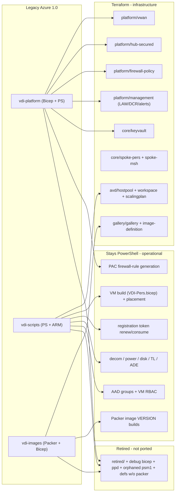
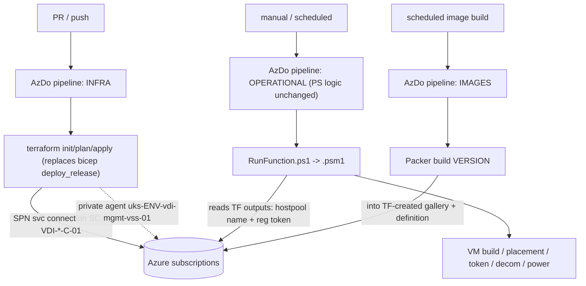
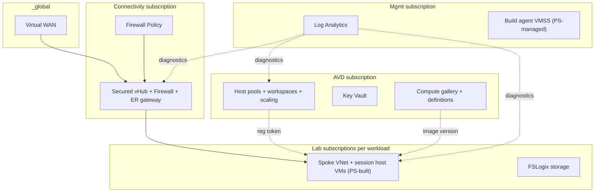
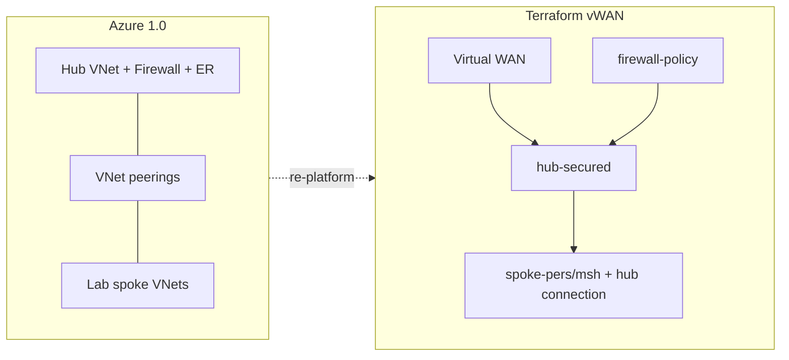

# Azure 1.0 to Terraform Migration Plan

**Status:** Planned
**Scope:** Port the legacy Azure 1.0 VDI estate (Bicep + PowerShell + AzDo pipelines across vdi-platform, vdi-scripts, vdi-images) onto the new Terraform module set.

Ports the legacy estate in `legacy/` onto the new Terraform modules, based on deep
inventory of the three repos (vdi-platform, vdi-scripts, vdi-images).

## Progress checklist

- [ ] Phase 0: live-vs-dead code triage (inventory + dead-code list)
- [ ] Phase A: extend naming abbreviations, update tags mandatory keys, legacy->TDA rename map
- [ ] Phase B: multi-sub/provider-alias topology, keep dev-tier split, drop ppd, subscription inventory verbatim
- [ ] Phase C: re-platform peering -> vWAN, carry IP ranges/VNets/subnets verbatim, port firewall rules + PAC
- [ ] Phase D: port LAW/mgmt/keyvault + alerts + DCR/DCE
- [ ] Phase E: AVD objects to modules; wire registration-token output; retire bicep hostpool path
- [ ] Phase F: gallery for_each (~50 defs) + RBAC; update Packer/pipeline names; retire gallery bicep
- [ ] Phase G: de-hardcode owner/cost/CMDB/subscription/tenant/DNS/GUID into tfvars + tags module
- [ ] Phase H: convert AzDo deploy stages bicep -> terraform; keep operational PS pipelines

## Locked decisions
- **Naming**: TDA everywhere. All TF-managed resources get TDA names; Packer/pipeline/param name references updated to match (rename workstream).
- **Topology**: Preserve the multi-subscription split (hub / avd / mgmt / lab / image-build). Drop `ppd` (pre-prod retired). Keep dev-tier codes (`idv`, `ici`, `itt`, `int`) split for now (mapping TBD in Phase B). `prd` -> `prod`. Promotion flow dev -> prod. Provider aliases + per-scope root stacks.
- **Gallery**: Reproduce all ~50 legacy definitions via `for_each` from a ported `configSets.json`, emitting TDA names.
- **VMs stay PowerShell**: session hosts, placement, token consumption, decom, power, RBAC, packaging remain operational PS. Terraform owns platform + AVD service objects and issues the registration token.

## What moves to Terraform vs stays PowerShell
- Terraform (infra): hub/vWAN connectivity, firewall policy, LAW/management, DCR/DCE, key vaults, spokes, host pools, app groups, workspaces, scaling plans, compute gallery + image definitions, subscription RBAC, alerts.
- Stays PowerShell (operational): VM build (`arm/VDI-Pers.bicep`), `Get-Placement*`, token renewal/consumption, decom, power mgmt, disk/TL/ADE, AAD group + VM RBAC, packaging, Packer image-version builds, PAC firewall-rule generation, subscription create/destroy.

## Target repository layout
```
vdi-terraform/
├── modules/                         # reusable Terraform (extended from greenfield build)
│   ├── naming/                      # TDA naming (extended with legacy resource abbreviations)
│   ├── tags/                        # bank tags: costCentre, securityClassification, resourceOwner, CMDB_AppID
│   ├── platform/{vwan,hub-secured,hub-unsecured,firewall-policy,management}/
│   ├── core/{spoke-pers,spoke-msh,keyvault,storage-fslogix}/
│   ├── avd/{hostpool,workspace,scalingplan}/
│   └── gallery/{gallery,image-definition}/
├── environments/                    # root stacks (multi-subscription via per-scope roots / provider aliases)
│   ├── _global/                     # shared Virtual WAN
│   ├── idv/ ici/ itt/ int/          # dev-tier env codes (kept split for now)
│   │   └── <env>/
│   │       ├── connectivity/        # hub-secured + firewall-policy   (connectivity subscription)
│   │       ├── mgmt/                # mgmt VNet + LAW + agent RBAC     (mgmt subscription)
│   │       ├── avd/                 # host pools, workspaces, KV, gallery (avd subscription)
│   │       └── labs/                # spokes + FSLogix                 (lab subscriptions)
│   └── prod/                        # (legacy prd) same per-scope layout
├── pipelines/                       # AzDo YAML - terraform deploy stages (was bicep) + operational PS
├── docs/                            # rename map, live inventory, dead-code list, topology, runbooks
└── legacy/                          # gitignored reference copy of Azure 1.0 repos (not deployed)
```

## What goes where (legacy -> destination)


## Pipeline flow (AzDo stays; deploy step becomes Terraform)


## Runtime topology (subscriptions + vWAN)


## Connectivity re-platform (peering -> vWAN)
Legacy `bicep/hub` (hub VNet + `azurerm_firewall` + ER gateway + `bicep/peering` VNet peerings) becomes vWAN: `platform/vwan` + `hub-secured` + `firewall-policy`, spokes via `core/spoke-pers` / `core/spoke-msh` using `azurerm_virtual_hub_connection` instead of peering. IP ranges preserved; only the connectivity mechanism changes.



## Phased workstreams

### Phase 0 - Live vs dead code triage (gates everything)
- Enumerate pipeline entry points across the three repos and trace what each invokes (`RunFunction.ps1` -> imported `.psm1`, `deploy_release` -> which bicep, Packer -> which `.pkr.hcl`).
- Build a live inventory of files referenced by an active pipeline.
- OUT of scope: `*/retired/`, `debug`/`debug2` bicep, definitions with no matching `.pkr.hcl`, `.psm1` never imported, orphaned params, superseded workloads, and all `ppd` params/config/env folders.
- Produce `docs/legacy-live-inventory.md` and `docs/legacy-dead-code.md`.

### Phase A - Foundations for migration
- Extend `modules/naming` with missing legacy abbreviations (VMSS `vss`, DCR/DCE, app group, workspace, peering); confirm outputs.
- Update `modules/tags` mandatory schema to `costCentre`, `securityClassification`, `resourceOwner`, `CMDB_AppID`.
- Produce `docs/legacy-to-tda-rename-map.md` (every legacy name -> new TDA name).

### Phase B - Subscription & environment topology
- Define provider-alias strategy (connectivity / avd / mgmt / lab / imagebuild).
- Restructure `environments/`: keep dev-tier codes split, `prd` -> `prod`, drop `ppd`, keep `_global`.
- Document what each dev-tier code maps to; propose (do not act on) later consolidation. Known: `int` = DT (dev test), the standard dev/test deploy target; `idv`/`ici`/`itt` TBD.
- Externalise per-env subscription/tenant/service-connection values into tfvars.
- Preserve the subscription set verbatim into `docs/subscription-inventory.md` + tfvars.

### Phase C - Connectivity + firewall
- Preserve the full address plan verbatim (all `net_*` CIDRs + corporate DNS) into per-env tfvars.
- Preserve VNet + subnet mapping (named subnets, current prefixes).
- Map `bicep/hub/rsg_network.bicep` -> vWAN hub-secured using preserved ranges.
- Port `params-netsec.json` firewall rules into `firewall-policy` inputs (CIDRs unchanged).
- Keep PAC rule injection as a PS pre-step emitting `firewall_rules.auto.tfvars.json`.
- Replace peering + `sub_subsInfo.ps1` discovery with explicit `virtual_hub_connection`s (addressing unchanged).

### Phase D - Platform services (LAW, mgmt, keyvault, alerts)
- `bicep/law` -> management LAW; `bicep/avd/rsg_keyvault.bicep` + KV lifecycle -> `core/keyvault`.
- `bicep/mgmt` networking/RBAC -> TF; agent VMSS stays PS or later TF module.
- Port ~17 `alert-templates` into management alert maps + action groups.
- Port DCR/DCE (`vdi-scripts/arm/uks-EEE-vdi-avd-dcr-*.bicep`) into management DCR inputs.

### Phase E - AVD service objects + token contract
- `New-VDIAVDHostpool` (host pool + app group + workspace) -> `avd/hostpool` + `avd/workspace`; scaling plan -> `avd/scalingplan`.
- Expose TF outputs so `Get-PlacementAVD` reads the live registration token; keep `Start-TokenRenewal`.
- Retire the bicep hostpool path; update persona->pool-ID references to new TDA names.

### Phase F - Gallery + images
- Port `configSets.json` into a tfvars map; `for_each` image-definition to reproduce all ~50 defs with TDA names.
- Port per-env gallery RBAC into gallery `role_assignments`.
- Update 37 `.pkr.hcl` + `Images_CreateInputVariablesJSON.ps1` to new TDA names; Packer keeps building versions.
- Retire `vdi_gallery_deployment.yml` + `Images_DeployGalleries.ps1` bicep path.

### Phase G - De-hardcode + tagging cleanup
- Move `resourceOwner`/`costCentre`/`CMDB_AppID`/`securityClassification`/emails into tfvars + tags module.
- Externalise `@allowed` subscription/LAW/SecOps IDs, hub VNet name lists, corporate DNS, GUIDs.

### Phase H - Pipeline conversion (AzDo, stays for now)
- Replace GLB `deploy_build`/`deploy_release` (bicep) with `terraform init/plan/apply` stages using the same SPNs and private agents.
- Keep operational PS pipelines unchanged except name-reference updates.
- Preserve deploy order: hub -> mgmt -> avd(LAW) -> peering/connections last.

## Risks / call-outs
- TDA-all naming touches many scripts/pipelines/packer files (name strings only) - largest churn item; mitigated by the rename map + scripted search/replace.
- vWAN re-platform is not 1:1 with peering; validate routing intent vs the legacy 3-rule UDR/PAC egress model with the network team.
- `terraform plan` against real subscriptions is the true validation gate.
- Alerts + firewall-rule volume are large sub-projects; sequence after core connectivity is proven.
